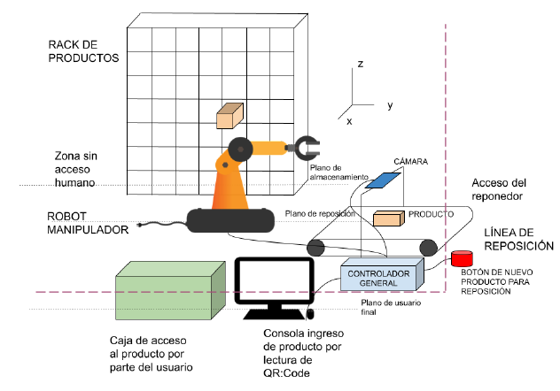

# Mecabot


## Descripción

En este proyecto desarrollaremos un robot que se encargará de la reposición y la obtención de medicamentos en una farmacia.

El robot constará de una interfaz gráfica para la comunicación con el usuario que pedirá el medicamento y un par de leds para indicarle al empleado que repone los medicamentos el estado del robot.

Físicamente es un robot cartesiano que se mueve con 3 grados de libertad y con la ayuda de una cinta transportadora se encarga de reponer y entregar los medicamentos en una gabeta.



## Interfaz Gráfica

La interfaz gráfica está hecha en python a través de *pyQt5*. Utiliza un diseño minimalista y simple de tal forma que cualquier persona pueda utilizarlo a través de una computadora o una pantalla táctil.

## Comunicación con el robot

Para la comunicación entre el robot y el ordenador se utiliza la comunicación UART configurada a 115200 baudios, utilizando la biblioteca de python llamada *pyserial* y codificando y decodificando entre UTF-8 y Unicode.

## Control del robot

Para el control del robot se utiliza un Arduino MEGA junto con algunos SHIELDS para controlar los motores de tipo paso a paso. El arduino se comunica con el programa en python a través de la comunicación UART. Notifica si hay una reposición y también cuando el robot terminó con su trabajo. Además de eso con el arduino se controlan todas las trayectorias que deberá tomar el robot a la hora de hacer su tarea.

## Requerimientos

Tener conectado un Arduino al ordenador.

Tener conectadas dos cámaras IP a la misma red que el ordenador.

Tener instalado pyQt5 que se instala de la siguiente manera.

### Ubuntu / Debian Linux

```
sudo apt-get install python3-pyqt5
sudo apt-get install zbar-tools
```

También necesitará la instalación de lo especificado en requirements.txt

```
pip3 install -r requirements.txt
```

## Ejecución

Para poder ejecutar el programa deberá ubicarse en la carpeta `/src/GUI`.

Luego abra el archivo `qtpy.py` con su editor de texto favorito y modifique lo siguiente:

El puerto del arduino se debe modificar por el correspondiente a su ordenador cuando conecta el dispositivo. (Puede verlo utilizando el IDE de arduino)

```arduino = serial.Serial(port='PUERTO DEL ARDUINO', baudrate=115200, timeout=.2)```

Las siguientes líneas de código se completan con las direcciones de las cámaras ip correspondiente a la que utiliza el cliente para hacer el pedido con su receta y la que corresponde a la cámara que verifica el medicamento entrante por la línea de reposición respectivamente.

```
url = "URL DE LA CÁMARA QR"
url_repo = "URL DE LA CÁMARA DE REPOSICIÓN"
```

Para poder comunicar un programa python con un dispositivo conectado al ordenador (Arduino) se necesitarán permisos de administrador y además para ejecutar desde un environment de Anaconda deberá especificar el python correcto.

Desde Ubuntu puede ejecutar la siguiente línea de código (reemplace "ENVIRONMENT NAME" por el nombre de su environment"):

```
sudo ~/miniconda3/envs/"ENVIRONMENT NAME"/bin/python3 qtpy.py
```

